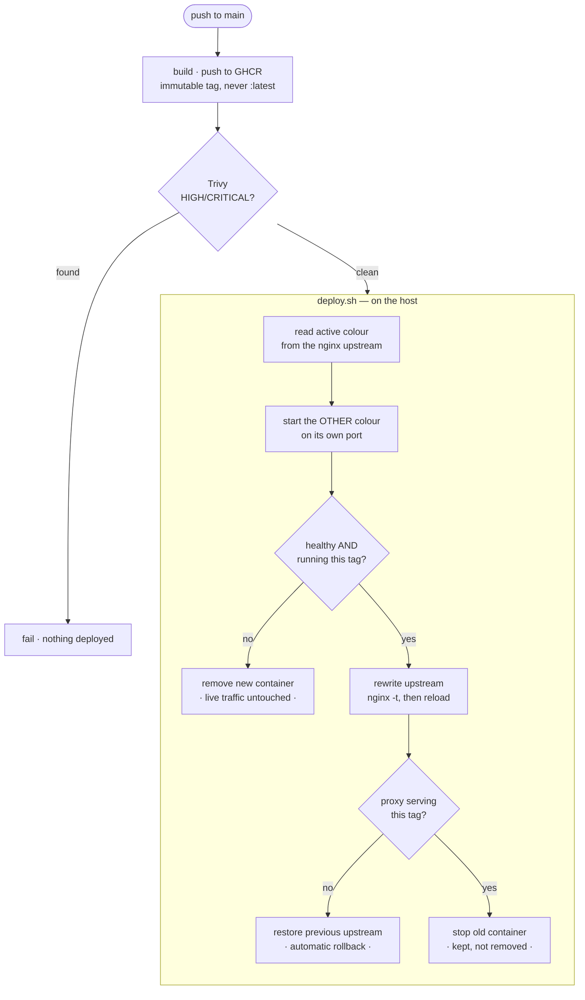

<div align="center">

# github-actions-ec2-deployment

**Blue/green CI/CD to a single EC2 host, with the deployment itself tested in CI.**

Health-gated switch · automatic rollback · zero downtime · no AWS account needed to verify it

[](https://github.com/Gautam-CyberSec/github-actions-ec2-deployment/actions/workflows/ci.yml)
[](.github/workflows)
[](.github/workflows/ci.yml)
[](LICENSE)

[Architecture](ARCHITECTURE.md) ·
[Lessons learned](LESSONS.md) ·
[Security](SECURITY.md) ·
[Roadmap](ROADMAP.md) ·
[Contributing](CONTRIBUTING.md)

</div>

---

Most deployment pipelines are only proven by deploying. That makes them the least
tested code in a repository — the part that runs last, in production, with the
smallest feedback loop.

The deployment script here is addressed at a generic SSH host rather than at EC2
specifically. Production points it at an instance; CI points it at a host it
controls and runs the whole thing — pull, start, health-check, switch, roll back
— on every push. Same script, same path, no AWS account required to know it works.

```bash
./deploy/deploy.sh --host <ip> --tag sha-abc123 --repo owner/app \
  --key ~/.ssh/deploy --known-hosts ./known_hosts
```

## How a deploy runs



The old container is **stopped, not removed**. Rolling back is then a container
start rather than an image pull — which matters precisely when the registry is
the thing that broke.

## Verified end to end, on every push

This is the real CI output, not an illustration:

```console
== first deploy (no previous colour) ==
  current     none
  deploying   blue on port 3001
  healthy after 1 attempt(s): {"status":"ok","version":"sha-390d146-1","color":"blue","uptime_s":0}
  upstream now points at blue
  serving {"status":"ok","version":"sha-390d146-1","color":"blue","uptime_s":1}

== second deploy (must alternate) ==
  current     blue
  deploying   green on port 3002
  healthy after 1 attempt(s): {"status":"ok","version":"sha-390d146-2","color":"green","uptime_s":0}
  upstream now points at green
  serving {"status":"ok","version":"sha-390d146-2","color":"green","uptime_s":1}
  stopped deploy-payload-blue — kept for rollback

== zero downtime ==
  ok   deploy during continuous traffic succeeds
  ok   no failed requests across the switch (0 failed)

== a broken build must not take traffic ==
  ok   deploy of a missing image fails
  ok   upstream unchanged after a failed deploy (still blue)
  ok   traffic still served by the previous build

13 passed, 0 failed
```

| Property | How it is proven |
|---|---|
| Deploys alternate colour | Two deploys asserted to land on blue then green |
| The new build is actually serving | Health check compares the reported version against the deployed tag |
| Zero downtime | Continuous polling across a live switch, asserting **0** failed requests |
| A broken build never takes traffic | A deploy of a non-existent tag must fail and leave the upstream untouched |
| Rollback is possible | Previous container asserted present and stopped |
| Host identity is verified | `known_hosts` supplied; `StrictHostKeyChecking=yes` |

## Seven decisions worth reading

| | Decision | Why |
|---|---|---|
| 1 | **The target is a generic SSH host, not "EC2"** | The same script runs against production and against a host CI controls, so the deployment path is exercised on every push instead of only in production. |
| 2 | **Health means "healthy *and* running this build"** | A container that reports OK while still running the previous image has not deployed. The check compares the reported version against the tag. |
| 3 | **`:latest` is refused outright** | A moving tag makes verification and rollback meaningless — the tag a deploy records can point at different bytes tomorrow. Rejected in code, with a test. |
| 4 | **Switch by nginx reload, not restart** | Reload drains existing connections. Restart cuts them, which is a deploy-shaped outage. |
| 5 | **The old container is stopped, not removed** | Rollback becomes a start rather than a pull, which is what you want when the registry is what failed. |
| 6 | **The deploy user gets sudo for `nginx` and `mv`. Nothing else** | A deployment account with full sudo is an account that can do anything. Granted explicitly by `bootstrap.sh` and validated with `visudo -c`. |
| 7 | **Deployment is manual or release-triggered** | Deploying every push to main is a choice, not a default. A reader copying this should opt in rather than inherit it. |

Full reasoning, including what was rejected, is in **[ARCHITECTURE.md](ARCHITECTURE.md)**.

## Layout

```
├── deploy/
│   ├── deploy.sh           blue/green orchestration over SSH
│   ├── lib.sh              colour, port, image and health logic — pure, testable
│   ├── nginx/              proxy config and the upstream deploy.sh rewrites
│   └── remote/bootstrap.sh one-time host preparation, scoped sudo
├── tests/
│   ├── test_deploy_lib.sh  33 unit tests — no SSH, no Docker, no AWS
│   └── e2e.sh              13 checks against a real host with real nginx
├── app/                    minimal payload; reports which build it is
└── .github/workflows/
    ├── ci.yml              lint · unit · build · scan · end-to-end deploy · links
    └── deploy.yml          production deployment, manual or on release
```

## Setup

**On the host**, once:

```bash
sudo ./deploy/remote/bootstrap.sh --deploy-user deploy --pubkey "ssh-ed25519 AAAA..."
```

Installs Docker and nginx, creates the deploy user, and grants sudo for exactly
`nginx` and `mv`. Harden SSH itself with
[Linux-Server-Hardening](https://github.com/Gautam-CyberSec/Linux-Server-Hardening).

**In the repository**, four secrets:

| Secret | Purpose |
|---|---|
| `DEPLOY_HOST` | Instance address |
| `DEPLOY_USER` | SSH user created by bootstrap |
| `DEPLOY_SSH_KEY` | Private key, deploy-only |
| `DEPLOY_KNOWN_HOSTS` | Host public key — without it, identity is not verified |

Scoped to a `production` environment so deployment requires approval.

## Development

```bash
make check      # actionlint, shellcheck, shfmt, hadolint, unit tests
make dry-run    # print a deployment plan, contacting nothing
make e2e        # full deployment against a real host
```

The colour, port, image-reference and health-verification logic are pure
functions over their arguments, so the 33 unit tests run with no SSH, no Docker
and no AWS. Everything that genuinely needs a host is covered by `tests/e2e.sh`.

## Relationship to the other repositories

This builds on them rather than repeating them:

- Container hardening — multi-stage, npm-free runtime, non-root — is
  [docker-node-postgres-stack](https://github.com/Gautam-CyberSec/docker-node-postgres-stack).
  The pattern is applied here, not re-explained.
- Host hardening — SSH, firewall, unattended upgrades — is
  [Linux-Server-Hardening](https://github.com/Gautam-CyberSec/Linux-Server-Hardening).
- The VPC and IAM the instance runs in are
  [terraform-aws-vpc-baseline](https://github.com/Gautam-CyberSec/terraform-aws-vpc-baseline).

## Security

Host key verification, scoped sudo, GHCR authentication via `GITHUB_TOKEN`
rather than a stored personal token, credentials shredded after use, and the
database of what is *not* verified here. See [SECURITY.md](SECURITY.md).

> **Honest scope:** the deployment path is verified against a real SSH host in
> CI. It has **not** been run against an actual EC2 instance — no AWS account was
> used in building this. What that does and does not cover is stated plainly in
> [SECURITY.md](SECURITY.md#what-is-not-verified).

## Roadmap

See [ROADMAP.md](ROADMAP.md).

## Engineering decisions &amp; lessons learned

Three mistakes made while building this — including an image that built and
pushed successfully but could not be scanned, and a hardening pattern that was
cited in a comment instead of applied.

**[Read the retrospective →](LESSONS.md)**

## Licence

[MIT](LICENSE)

---

<div align="center">

**Gautam** · Cloud &amp; Backend Engineer

[Portfolio](https://Gautam-cloud.com) ·
[LinkedIn](https://linkedin.com/in/gautam-cybersec) ·
[gautamdem@gmail.com](mailto:gautamdem@gmail.com)

</div>
